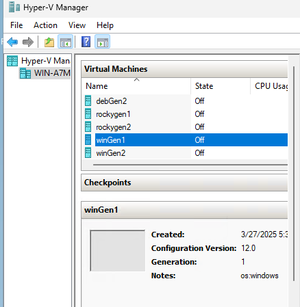

# Section 1. Prepare the Work Environment

1. Create a Virtual Environment (venv):
    ```
    python3 -m venv ./venv
    ```
2. Activate the Virtual Environment (venv):
    ```
    source ./venv/bin/activate
    ```
3. Install Dependencies from req.txt:
    ```
    pip install -r req.txt
    ```
4. Provide your connection data and credentials in an env.json Configuration File (Section 3):
    ```
    {
        "HYPERV_IP":"a.b.c.d",
        "HYPERV_USER":"administrator",
        "HYPERV_PASS":"changeme",
    ...
    ```
5. Run Initial Validation:
    ```
        make dryrun
    ```

6. Run Migrations:
    ```
        make run
    ```

7. Run Migrations in Debug Mode:
    ```
        make debug
    ```

# Section 2. Required Actions on Hyper-V/VM Side:
Run the Appropriate Script Based on the System:

    Depending on the source system (Windows/Linux), you need to run the corresponding script from the prep_script directory on a migrated VM.

In Hyper-V Manager Console:

    For Windows systems, make sure to add os:windows in the "Notes" section so that the migration script is able to properly identify and categorize the system.



# Section 3. Required Edits to the env.json File:
```
"HYPERV_IP":"192.168.100.129",  # Hyper-V server IP address
"HYPERV_USER":"administrator",  # Username
"HYPERV_PASS":"change_me",      # Password
"HYPER_VM_LIST": [              # List of Hyper-V machine IDs to be migrated
    "8de199b6-d858-45d6-81ef-55eb7a3dbf6f",
    "62ac9e25-800c-4546-a97e-7f6141bf9ea4"
    ],
"HYPERV_AUTO_SHAREDISK": true,  # If true, the script automatically creates network shares to import the disk
"HYPERV_SHAREDISK":"VMDisks",   # Default network share where disks are stored (if HYPERV_AUTO_SHAREDISK is set to false)
"HYPERV_SHAREDISK_MAPPING":     # Mapping of the share/disk path to the Proxmox storage where the disk will be imported
    [
        {
            "C:/VMDisks":"VMDisks",
            "PROXMOX_STORAGE":"data"
        },
        {
            "E:/VMDisksSSD":"VMDisksSSD",
            "PROXMOX_STORAGE":"space"
        }
    ],
"PROXMOX_IP":"192.168.100.252",      # Proxmox server IP address
"PROXMOX_USER":"root",               # Username
"PROXMOX_PASS":"change_me",          # Password
"PROXMOX_MOUNTPATH":"/root/tmp",     # Workdir where directories for mounting Hyper-V shares will be created
"PROXMOX_IMPORTPATH":"/root/import", # Temporary disk needed for converting VHDX to QCOW2
"PROXMOX_STORAGE":"data",            # Default datastore in Proxmox where disks will be imported
"PROXMOX_SWITCH_DEFAULT":"vmbr0",    # Default bridge to connect virtual machine network adapters to after migration
                                      # (unless PROXMOX_SWITCH_MAPPING defines a different bridge)
"PROXMOX_SWITCH_MAPPING":{           # Mapping network adapters to specific bridges based on Hyper-V switchId
        "f3f8527d-2d64-4636-a1b4-bf84d2816fbd":"vmbr1",
        "4673abd7-1014-4cf4-9cb0-ffffffffffff":"vmbr2"
},  
"PROXMOX_NETWORK_TYPE":"e1000",      # Default network adapter type
"PROXMOX_START_AFTER": true,         # If true, start the virtual machine(s) after migration is completed
"PROXMOX_IMPORT_ONCE": true          # If true, perform only one import (useful for testing)
```
